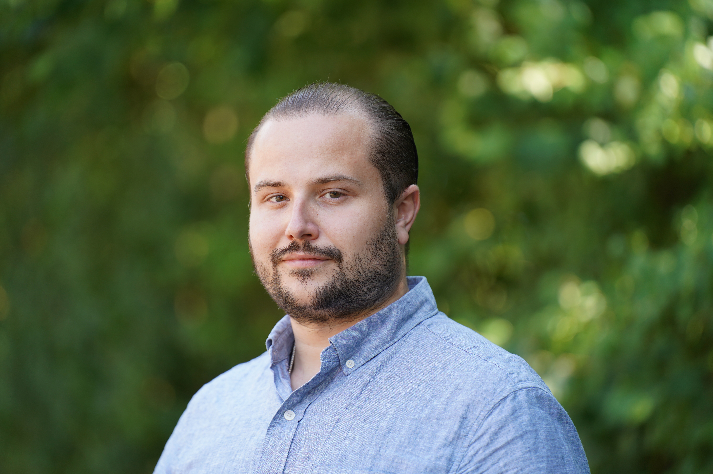

{fig-align="center" width="50%"}

I'm currently a Research Associate at the **University of Cambridge**, where my research focuses on program verification in the context of climate science.

Previously, I completed my PhD in the Embedded Systems group at **Uppsala University**.

My research interests include:

- programming languages
- program verification
- embedded and real-time systems
- domain-specific languages
- compiler and interpreter implementation
- temporal and functional verification

## Education {.section-title}

#### PhD Computer Science — Embedded Systems
**Uppsala University, Sweden (2019–2025)**

Dissertation: [*Types and Time: Languages, Tools, and Methods for Reliable Systems Engineering*](papers/phd_dissertation.pdf)

#### MSc Space Technology — Spacecraft Design
**Luleå University of Technology, Sweden (2017–2019)**

Thesis: [*Porting Zephyr RTOS to the LEON/GRLIB SoC SPARC v8 architecture*](papers/master_thesis.pdf)

#### BSc Engineering Physics
**Vienna University of Technology, Austria (2012–2017)**

Thesis: [*Extending the Software Environment of the qBounce Platform*](papers/bachelor_thesis.pdf)