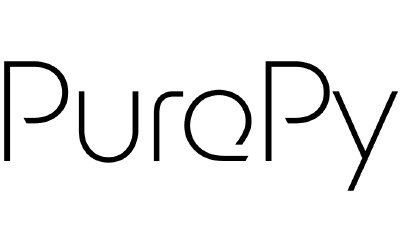

## Current Projects

::: {.project}

{width=120}

### [PurePy](https://pure-py.github.io)

PurePy defines a pure, side-effect-free subset of Python. 
It is aimed initially at researchers in programming languages and pedagogy, 
and is intended to grow into a common language for scientific computing, 
supporting portable applications in modelling, data processing, analysis, 
and visualisation.

:::

::: {.project}

{width=120}

### [Fortl](https://github.com/plas4sci/fortl)

Fortl is a statically typed programming language for scientific and numerical computing built around graded types. 
By enriching types with domain-specific properties, Fortl enables scientific intent, 
model assumptions, and correctness properties to be expressed directly in code and verified statically. 
With a Python-inspired syntax, it combines expressive, reliable scientific programming with a low barrier to entry for
users working in the scientific computing domain.

:::

::: {.project}

{width=120}

### [CamFort](https://camfort.github.io)

A verification and refactoring framework for scientific Fortran. 
My work focuses on extending CamFort with new methods and techniques to 
improve program analysis and verification for climate and scientific computing applications.

:::